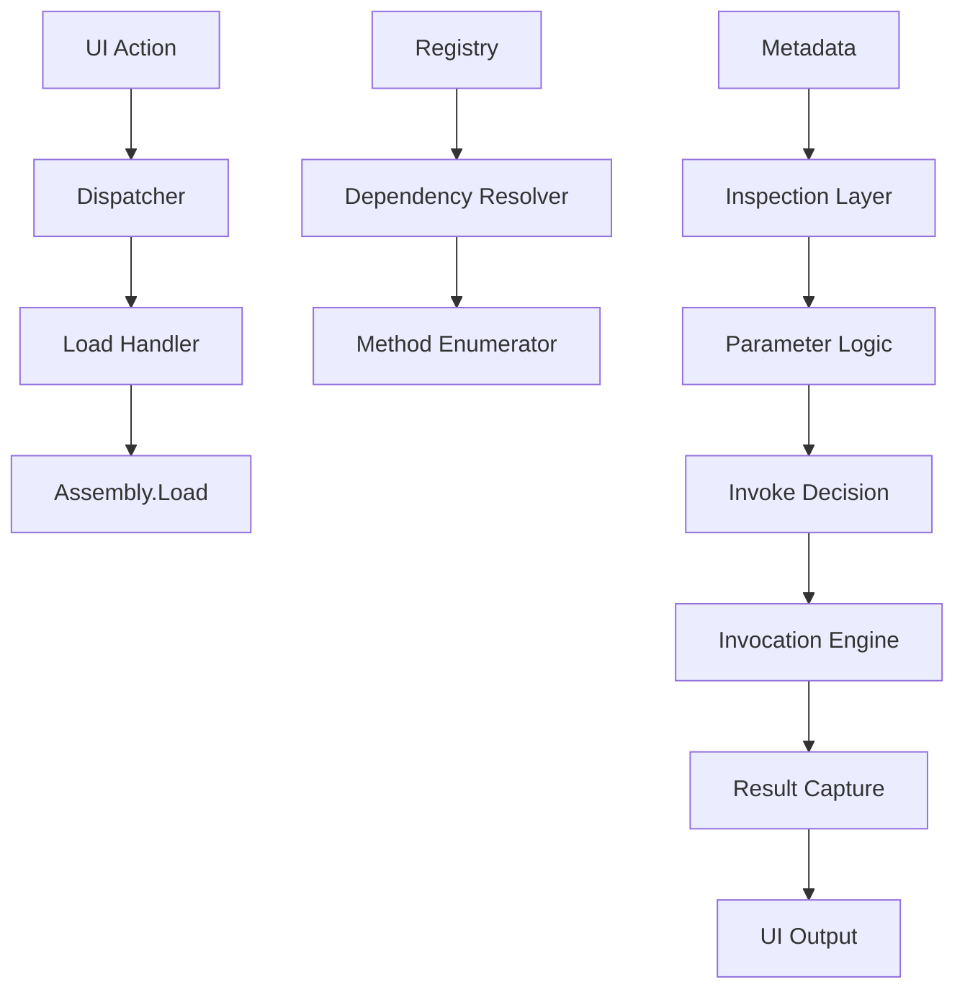

# Architecture & Core Concepts

## 1. Core Philosophy
**Does it Execute?** Yes.
**Is it Safe?** Controlled, but inherently risky.

### The Mental Model
Think of **DotNet DLL Invoker** as a debugger without a program counter, operating at the method boundary instead of process start.
1.  **Explicit Control:** Nothing executes automatically. "Invoke" is a conscious action.
2.  **Maximum Visibility:** All methods (Private/Static/etc.) are visible.
3.  **Analyst-First Design:** Prioritizes understanding over convenience. Assumes DLLs may be hostile.

---

## 2. High-Level Architecture
The solution follows a strict "Contract-First" directory structure to separate concerns.

### 🧱 Top-Level Structure
*   **`src/DotNetDllInvoker.Core`**: The application brain. Orchestrates data flow but does not execute.
*   **`src/DotNetDllInvoker.Execution`**: **(⚠ DANGER ZONE)** The *only* layer allowed to call `MethodInfo.Invoke`. Isolated for auditability.
*   **`src/DotNetDllInvoker.Reflection`**: Logic for reading metadata, IL, and decompiling code. Read-Only.
*   **`src/DotNetDllInvoker.UI`**: WPF Presentation layer (MVVM).

### ⚙ Key Components
1.  **Shared**: Utilities (`Guard.cs`). Zero logic.
2.  **Contracts**: Interfaces (`IMethodInvoker`, `IAssemblyLoader`). Defines *what*, not *how*.
3.  **Results**: Structured outcomes (`InvocationResult`). Never leak raw exceptions.
4.  **Reflection**: `AssemblyLoader.cs` (AssemblyLoadContext), `DecompilerService.cs`.
5.  **Dependency**: Read-only dependency resolution.
6.  **Parameters**: `AutoParameterGenerator` for type-safe default inputs.

---

## 3. Low-Level Execution Pipeline
Visualizes the pipeline:

### Execution Boundary (`src/DotNetDllInvoker.Execution`)
*   **Boundary:** `MethodInfo.Invoke` is the SINGLE execution point.
*   **Safety:** Wrapped in `try/catch (TargetInvocationException)`.
*   **Async Handling:** Automatically awaits `Task` and `Task<T>` return types.

---

## 4. Control Flows

### A. DLL Load Flow
1.  User selects **Add DLL**.
2.  Tool validates file existence.
3.  DLL is loaded via `AssemblyLoadContext`.
4.  Metadata extracted (Name, Version).
5.  **Guarantee:** No method executed. Static constructors *may* run implicitly by CLR.

### B. Dependency Resolution Flow
*   **Runtime Hook:** `AssemblyLoadContext.Resolving` event probes adjacent files.
*   **Trigger:** When executed code requests a missing DLL.
*   **Outcome:** Seamless execution for side-by-side dependencies.

### C. Parameter Resolution Flow
1.  **User Inputs?** ✅ Use them.
2.  **Missing?** ❌ Trigger **Auto Parameter Generator**.
    *   Creates defaults (0, false, null).
    *   Enables "Dry Run" execution.

### D. Invocation Flow (Single Method)
1.  Check Dependency Status.
2.  **Instance Creation:** (if non-static).
3.  **Invocation:** `MethodInfo.Invoke`.
4.  **Capture:** Result / Output / Exception.
5.  **Render:** To UI Log.

---

## 5. UI Architecture (WPF)
*   **Pattern:** MVVM (Model-View-ViewModel).
*   **Threading:** Strict UI/Background separation. Long-running tasks use `Task.Run`.
*   **Dynamic Views:**
    *   **Method Cockpit:** Auto-generated input controls based on `ParameterInfo`.
    *   **Dependency Sidebar:** Overlay for dependency status.
    *   **Decompiler Tab:** Integrated `ICSharpCode.Decompiler` view.
