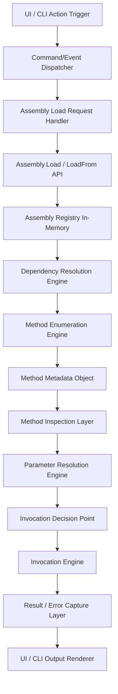

# Low-Level Execution Diagram

**Purpose:** Visualizes the `Reflection -> Parameter -> Invocation` pipeline.

## Key Mechanics
1.  **Assembly Loading:** Uses `Assembly.Load*`. Only metadata access. **Warning:** Static constructors may run.
2.  **Method Enumeration:** `BindingFlags.Public | NonPublic | Static | Instance | DeclaredOnly`.
3.  **Invocation Engine (The Danger Zone):**
    *   **Boundary:** `MethodInfo.Invoke` is the SINGLE execution point.
    *   **Safety:** Wrapped in `try/catch (TargetInvocationException)`.
