# Backend Deep Dive - Complete Technical Reference

> **Purpose**: This document makes the DotNet DLL Invoker backend an "open book". Every component, API call, and design decision is explained.

---

## Table of Contents
1. [Architecture Overview](#architecture-overview)
2. [Module Dependency Graph](#module-dependency-graph)
3. [Coding Standards Header](#coding-standards-header)
4. [Module Deep Dives](#module-deep-dives)
5. [.NET APIs Reference](#net-apis-reference)
6. [External Libraries](#external-libraries)
7. [Control Flows](#control-flows)
8. [Calling Conventions](#calling-conventions)
9. [Challenging Q&A](#challenging-qa)

---

## Architecture Overview

### Core Philosophy
```
┌─────────────────────────────────────────────────────────────────┐
│  "Does it Execute?" - Yes                                        │
│  "Is it Safe?" - Controlled, but inherently risky               │
└─────────────────────────────────────────────────────────────────┘
```

### The 7 Commandments
1. **Core** never executes code
2. **Execution** never touches UI
3. **Reflection** never makes decisions
4. **Parameter** logic is deterministic
5. **Results** are structured, not strings
6. **Contracts** are immutable
7. **Shared** contains zero business logic

---

## Module Dependency Graph

```mermaid
graph TD
    subgraph "Presentation Layer"
        CLI["DotNetDllInvoker.CLI"]
        UI["DotNetDllInvoker.UI"]
    end
    
    subgraph "Core Layer"
        Core["DotNetDllInvoker.Core<br/>⭐ Orchestration Brain"]
    end
    
    subgraph "Business Layer"
        Reflection["DotNetDllInvoker.Reflection<br/>📖 Metadata Only"]
        Dependency["DotNetDllInvoker.Dependency<br/>🔗 Analysis"]
        Parameters["DotNetDllInvoker.Parameters<br/>🎯 Type-Safe Synthesis"]
        Execution["DotNetDllInvoker.Execution<br/>⚠️ DANGER ZONE"]
    end
    
    subgraph "Foundation Layer"
        Contracts["DotNetDllInvoker.Contracts<br/>📜 Interfaces & Records"]
        Results["DotNetDllInvoker.Results<br/>📦 Structured Outcomes"]
        Shared["DotNetDllInvoker.Shared<br/>🔧 Utilities"]
    end
    
    CLI --> Core
    UI --> Core
    UI -.->|IPC (JSON)| CLI
    
    Core --> Reflection
    Core --> Dependency
    Core --> Parameters
    Core --> Execution
    
    Reflection --> Contracts
    Reflection --> Shared
    Dependency --> Contracts
    Dependency --> Shared
    Parameters --> Contracts
    Parameters --> Shared
    Execution --> Contracts
    Execution --> Results
    Execution --> Shared
    
    Results --> Shared
    Core --> Contracts
    Core --> Results
    Core --> Shared
```

---

## Coding Standards Header

Every source file follows this header format:

```csharp
// File: src/[Module]/[FileName].cs
// Project: DotNet DLL Invoker
//
// Responsibility:
// [What this file does - single responsibility]
//
// Depends on:
// - [List of dependencies]
//
// Used by:
// - [List of callers]
//
// Execution Risk:
// [None | Low | Medium | ⚠ High]
```

---

## Module Deep Dives

---

### 1. DotNetDllInvoker.Contracts (Foundation)

> **Role**: Pure interfaces and immutable data records. Zero logic.

#### Files

| File | Responsibility | Used By | Depends On |
|------|---------------|---------|------------|
| `IAssemblyLoader.cs` | Contract for loading assemblies | Reflection | - |
| `IMethodInvoker.cs` | Contract for method execution | Execution | - |
| `IMethodEnumerator.cs` | Contract for method scanning | Reflection | - |
| `IParameterResolver.cs` | Contract for parameter resolution | Parameters | - |
| `IDependencyResolver.cs` | Contract for dependency analysis | Dependency | - |
| `LoadedAssemblyInfo.cs` | Immutable record holding assembly + context | All modules | System.Runtime.Loader |
| `DependencyRecord.cs` | Immutable record for dependency info | Dependency | - |
| `DependencyStatus.cs` | Enum: Found, Missing, VersionMismatch | Dependency | - |
| `InvocationMode.cs` | Enum: Manual, Auto | Parameters | - |

#### Key Record: LoadedAssemblyInfo

```csharp
public class LoadedAssemblyInfo
{
    public Assembly Assembly { get; }           // The loaded assembly
    public AssemblyLoadContext Context { get; } // For unloading
    public string FilePath { get; }             // Original path
    public string Name { get; }                 // Assembly name
    
    public void Unload()
    {
        Context.Unload();  // Triggers collectible context cleanup
    }
}
```

**Why AssemblyLoadContext is stored:**
- .NET Core/5+ requires `AssemblyLoadContext` for true unloading
- Without it, assemblies live in memory forever
- `isCollectible: true` enables runtime to reclaim memory after GC

---

### 2. DotNetDllInvoker.Shared (Foundation)

> **Role**: Dumb utilities only. If it "thinks", it doesn't belong here.

#### Files

| File | Responsibility | Used By | Depends On |
|------|---------------|---------|------------|
| `Guard.cs` | Argument validation helpers | All modules | - |
| `ErrorCodes.cs` | Centralized error code constants | Results, Execution | - |
| `Logger.cs` | Simple logging facade | Optional | - |

#### Guard.cs - Pseudocode

```
function Guard.NotNull(value, paramName):
    if value is null:
        throw ArgumentNullException(paramName)
    return value

function Guard.NotNullOrEmpty(value, paramName):
    Guard.NotNull(value, paramName)
    if value is empty string:
        throw ArgumentException("Cannot be empty", paramName)
    return value
```

---

### 3. DotNetDllInvoker.Results (Foundation)

> **Role**: Structured outcome handling. Never leak raw exceptions to UI.

#### Files

| File | Responsibility | Used By | Depends On |
|------|---------------|---------|------------|
| `InvocationResult.cs` | Immutable result record | Execution, Core, UI | - |
| `InvocationError.cs` | Structured error record | Results | - |
| `ResultFormatter.cs` | String formatting for display | UI | - |

#### InvocationResult - Data Structure

```csharp
public record InvocationResult
{
    public bool IsSuccess { get; init; }
    public object? ReturnValue { get; init; }      // Method return value
    public InvocationError? Error { get; init; }   // Error details if failed
    public TimeSpan Duration { get; init; }        // Execution time
    public string CapturedStdOut { get; init; }    // Console.Write output
    public string CapturedStdErr { get; init; }    // Console.Error output
    
    // Factory methods
    public static InvocationResult Success(...) { ... }
    public static InvocationResult Failure(...) { ... }
}
```

**Why capture StdOut/StdErr?**
- Target DLLs may write to Console
- We redirect `Console.Out` and `Console.Error` during invocation
- Captured output is shown in DEBUG OUTPUT tab

---

### 4. DotNetDllInvoker.Reflection (Business Layer)

> **Role**: Everything reflection-related. **NOTHING EXECUTES HERE.**

#### Files

| File | Responsibility | Used By | Depends On | .NET APIs |
|------|---------------|---------|------------|-----------|
| `AssemblyLoader.cs` | Loads DLLs into collectible context | Core | Contracts, Shared | `AssemblyLoadContext`, `Assembly.LoadFromAssemblyPath` |
| `MethodScanner.cs` | Enumerates public methods | Core | Contracts | `Type.GetMethods`, `BindingFlags` |
| `ILReader.cs` | Parses IL bytes to instructions | UI | - | `MethodBody.GetILAsByteArray`, `OpCodes` |
| `DecompilerService.cs` | Generates C# source | UI | - | ICSharpCode.Decompiler (external) |
| `SignatureBuilder.cs` | Builds C# signatures from metadata | UI | - | `ParameterInfo`, `Type` |
| `ReflectionFlagsProvider.cs` | Centralized BindingFlags | MethodScanner | - | `BindingFlags` |
| `CallGraphAnalyzer.cs` | Builds method call graphs | UI | ILReader | IL parsing |

#### AssemblyLoader - Deep Dive

```csharp
public LoadedAssemblyInfo LoadIsolated(string path)
{
    // Step 1: Validation
    Guard.NotNullOrEmpty(path, nameof(path));
    if (!File.Exists(path))
        throw new FileNotFoundException(...);

    // Step 2: Create UNIQUE, COLLECTIBLE context
    string name = Path.GetFileNameWithoutExtension(path);
    var context = new AssemblyLoadContext(
        $"Isolated_{name}_{Guid.NewGuid()}", 
        isCollectible: true  // 🔑 KEY: Enables unloading
    );
    
    // Step 3: Setup dependency resolution
    var resolver = new ContextDependencyResolver(Path.GetDirectoryName(path));
    context.Resolving += resolver.OnResolving;

    // Step 4: Load and return
    try 
    {
        var assembly = context.LoadFromAssemblyPath(path);
        return new LoadedAssemblyInfo(assembly, context, path);
    }
    catch
    {
        context.Unload();  // Cleanup on failure
        throw;
    }
}
```

**Flowchart: Assembly Loading**


#### ILReader - Deep Dive

**Purpose**: Parse raw IL bytes into human-readable instructions.

**Algorithm Pseudocode**:
```
function Read(method):
    body = method.GetMethodBody()
    if body is null: return empty list
    
    ilBytes = body.GetILAsByteArray()
    instructions = []
    position = 0
    
    while position < ilBytes.length:
        offset = position
        opCodeValue = ReadByte(ilBytes, position)
        
        // Handle multi-byte opcodes (0xFE prefix)
        if opCodeValue == 0xFE:
            opCodeValue = 0xFE00 | ReadByte(ilBytes, position)
        
        opCode = LookupOpCode(opCodeValue)
        operand = ReadOperand(opCode.OperandType, ilBytes, position)
        
        instructions.Add({ offset, opCode, operand })
    
    return instructions
```

**OpCode Operand Types Handled**:
| OperandType | Size | Example | What We Do |
|-------------|------|---------|------------|
| InlineNone | 0 | `nop`, `ret` | Nothing |
| ShortInlineBrTarget | 1 | `br.s` | Read sbyte + calculate target |
| InlineBrTarget | 4 | `br` | Read int32 + calculate target |
| InlineMethod | 4 | `call`, `callvirt` | Resolve token → MethodInfo |
| InlineString | 4 | `ldstr` | `Module.ResolveString(token)` |
| InlineType | 4 | `newobj` | Resolve token → Type |

**Key .NET API**: `Module.ResolveMember(token)`
- Converts metadata token (int32) to `MemberInfo`
- Returns `MethodInfo`, `FieldInfo`, `TypeInfo`, etc.

#### CallGraphAnalyzer - Deep Dive

**Purpose**: Build a graph of which methods call which methods.

```csharp
private void AnalyzeMethod(MethodBase method, CallGraph graph)
{
    var instructions = ILReader.Read(method);  // Get IL
    
    foreach (var instruction in instructions)
    {
        // Look for call-related opcodes
        if (instruction.OpCode == OpCodes.Call ||
            instruction.OpCode == OpCodes.Callvirt ||
            instruction.OpCode == OpCodes.Newobj)
        {
            if (instruction.Operand is MethodBase calledMethod)
            {
                // Filter: Only include methods from SAME assembly
                if (calledMethod.DeclaringType?.Assembly == method.DeclaringType?.Assembly)
                {
                    graph.AddEdge(method → calledMethod);
                }
            }
        }
    }
}
```

**Why filter to same assembly?**
- Without filter: Graph shows Thread.Sleep, Console.WriteLine, etc.
- With filter: Graph shows only YOUR DLL's methods
- Makes analysis practical and focused

---

### 5. DotNetDllInvoker.Dependency (Business Layer)

> **Role**: Read-only dependency visibility. Predictive analysis only.

#### Files

| File | Responsibility | Used By | Depends On |
|------|---------------|---------|------------|
| `DependencyResolver.cs` | Analyzes referenced assemblies | Core | Contracts, Shared |

#### Algorithm

```
function ResolveDependencies(assembly):
    dependencies = []
    
    for each referencedAssembly in assembly.GetReferencedAssemblies():
        status = CheckIfLoaded(referencedAssembly)
        
        if status == NotLoaded:
            // Try to find on disk next to main assembly
            searchPath = assembly.Location directory
            status = SearchForFile(searchPath, referencedAssembly.Name)
        
        dependencies.Add({
            Name: referencedAssembly.FullName,
            Status: status,  // Found, Missing, VersionMismatch
            Path: foundPath or null
        })
    
    return dependencies
```

---

### 6. DotNetDllInvoker.Parameters (Business Layer)

> **Role**: Controlled parameter synthesis. Type-safe but logic-blind.

#### Files

| File | Responsibility | Used By | Depends On |
|------|---------------|---------|------------|
| `ParameterResolver.cs` | Orchestrates manual vs auto | Core, Execution | AutoParameterGenerator |
| `AutoParameterGenerator.cs` | Generates type-correct defaults | ParameterResolver | TypeDefaultMap |
| `TypeDefaultMap.cs` | Maps types to default values | AutoParameterGenerator | - |

#### Type Conversion Flow


#### TypeDefaultMap - Lookup Table

```csharp
private static readonly Dictionary<Type, Func<object>> _defaults = new()
{
    [typeof(string)] = () => "test",
    [typeof(int)] = () => 0,
    [typeof(bool)] = () => false,
    [typeof(double)] = () => 0.0,
    [typeof(DateTime)] = () => DateTime.Now,
    [typeof(Guid)] = () => Guid.NewGuid(),
    [typeof(char)] = () => 'a',
    [typeof(byte)] = () => (byte)0,
    [typeof(long)] = () => 0L,
    [typeof(float)] = () => 0f,
    [typeof(decimal)] = () => 0m,
    // Nullable types return null
};
```

---

### 7. DotNetDllInvoker.Execution (⚠ DANGER ZONE)

> **Role**: The ONLY place code runs. `MethodInfo.Invoke()` is ONLY here.

#### Files

| File | Responsibility | Used By | Depends On | Risk |
|------|---------------|---------|------------|------|
| `InvocationEngine.cs` | Executes methods | InvocationCoordinator | Guard, Results | ⚠ HIGH |
| `InstanceFactory.cs` | Creates object instances | InvocationCoordinator | - | Medium |
| `InvocationGuard.cs` | Pre-execution validation | InvocationEngine | - | Low |

#### InvocationEngine - The Execution Boundary

**This is the most critical file in the entire project.**

```csharp
public async Task<InvocationResult> InvokeAsync(
    MethodInfo method, 
    object? instance, 
    object?[] parameters, 
    CancellationToken cancellationToken)
{
    // ┌─────────────────────────────────────────────────────────────┐
    // │ PHASE 1: VALIDATION                                          │
    // └─────────────────────────────────────────────────────────────┘
    Guard.NotNull(method, nameof(method));
    InvocationGuard.EnsureInvokable(method);

    // ┌─────────────────────────────────────────────────────────────┐
    // │ PHASE 2: OUTPUT CAPTURE SETUP                                │
    // └─────────────────────────────────────────────────────────────┘
    var originalOut = Console.Out;
    var originalErr = Console.Error;
    using var stringWriterOut = new StringWriter();
    using var stringWriterErr = new StringWriter();

    Console.SetOut(stringWriterOut);  // Redirect stdout
    Console.SetError(stringWriterErr); // Redirect stderr

    var stopwatch = Stopwatch.StartNew();

    try
    {
        // ┌─────────────────────────────────────────────────────────┐
        // │ PHASE 3: ⚠ EXECUTION BOUNDARY ⚠                          │
        // │ Code below MAY execute UNTRUSTED DLL logic.              │
        // └─────────────────────────────────────────────────────────┘
        
        object? result = null;
        
        await Task.Run(async () => 
        {
            var rawResult = method.Invoke(instance, parameters);
            
            // Handle async methods (Task<T>)
            if (rawResult is Task task)
            {
                await task;
                
                // Extract result from Task<T>
                if (task.GetType().IsGenericType)
                {
                    result = task.GetType()
                        .GetProperty("Result")
                        ?.GetValue(task);
                }
            }
            else
            {
                result = rawResult;
            }
        }, cancellationToken);

        stopwatch.Stop();
        
        return InvocationResult.Success(
            result, 
            stopwatch.Elapsed, 
            stringWriterOut.ToString(),  // Captured stdout
            stringWriterErr.ToString()); // Captured stderr
    }
    catch (Exception ex)
    {
        // Unwrap TargetInvocationException
        var actualEx = (ex is TargetInvocationException tie) 
            ? tie.InnerException ?? tie 
            : ex;
            
        return InvocationResult.Failure(
            InvocationError.FromException(actualEx),
            stopwatch.Elapsed,
            stringWriterOut.ToString(),
            stringWriterErr.ToString());
    }
    finally
    {
        // ┌─────────────────────────────────────────────────────────┐
        // │ PHASE 4: RESTORE OUTPUT                                   │
        // └─────────────────────────────────────────────────────────┘
        Console.SetOut(originalOut);
        Console.SetError(originalErr);
    }
}
```

**Flowchart: Invocation Flow**


#### InstanceFactory - Object Creation

```csharp
public object? CreateInstance(Type type)
{
    if (type.IsAbstract || type.IsInterface)
        throw new InvalidOperationException("Cannot instantiate abstract type");
    
    return Activator.CreateInstance(type);  // Default constructor
}

public object? CreateInstance(Type type, ConstructorInfo ctor, object?[] args)
{
    return ctor.Invoke(args);  // Specific constructor with args
}
```

---

### 8. DotNetDllInvoker.Core (Orchestration Brain)

> **Role**: Application brain. Connects everything. No UI, no execution.

#### Files

| File | Responsibility | Used By | Depends On |
|------|---------------|---------|------------|
| `CommandDispatcher.cs` | High-level API, composition root | UI, CLI | All business modules |
| `InvocationCoordinator.cs` | Coordinates parameter resolution + invocation | CommandDispatcher | Execution, Parameters |
| `ProjectState.cs` | Mutable session state | CommandDispatcher | Contracts |
| `InstanceRegistry.cs` | Persists object instances (Object Workbench) | InvocationCoordinator | - |

#### CommandDispatcher - Composition Root

```csharp
public CommandDispatcher()
{
    // ┌─────────────────────────────────────────────────────────────┐
    // │ COMPOSITION ROOT                                             │
    // │ This is where all dependencies are wired up.                 │
    // │ Future: Could use DI container here.                         │
    // └─────────────────────────────────────────────────────────────┘
    
    _loader = new AssemblyLoader();           // Reflection module
    _scanner = new MethodScanner();           // Reflection module
    _dependencyResolver = new DependencyResolver(); // Dependency module
    
    var parameterResolver = new ParameterResolver(); // Parameters module
    var invoker = new InvocationEngine();     // Execution module
    
    _coordinator = new InvocationCoordinator(invoker, parameterResolver);
}
```

#### Complete Call Chain


---

## .NET APIs Reference

### Assembly Loading APIs

| API | Used In | Purpose |
|-----|---------|---------|
| `AssemblyLoadContext` | AssemblyLoader | Isolates loaded assemblies |
| `AssemblyLoadContext.LoadFromAssemblyPath` | AssemblyLoader | Loads DLL from disk |
| `AssemblyLoadContext.Unload()` | LoadedAssemblyInfo | Marks context for unloading |
| `AssemblyLoadContext.Resolving` | AssemblyLoader | Event for dependency resolution |

### Reflection APIs

| API | Used In | Purpose |
|-----|---------|---------|
| `Type.GetMethods(BindingFlags)` | MethodScanner | Enumerates methods |
| `MethodInfo.GetParameters()` | UI, Parameters | Gets parameter info |
| `MethodBody.GetILAsByteArray()` | ILReader | Gets raw IL bytes |
| `Module.ResolveMember(token)` | ILReader | Resolves metadata tokens |
| `Module.ResolveString(token)` | ILReader | Gets string literals |

### Execution APIs

| API | Used In | Purpose |
|-----|---------|---------|
| `MethodInfo.Invoke(instance, params)` | InvocationEngine | **THE** execution call |
| `Activator.CreateInstance(type)` | InstanceFactory | Creates objects |
| `ConstructorInfo.Invoke(args)` | InstanceFactory | Calls specific constructor |

### Type Conversion APIs

| API | Used In | Purpose |
|-----|---------|---------|
| `Convert.ChangeType(value, type)` | ParameterResolver | Converts string to primitives |
| `Enum.Parse(type, value)` | ParameterResolver | Parses enum values |
| `Guid.Parse(value)` | ParameterResolver | Parses GUIDs |

---

## External Libraries

### ICSharpCode.Decompiler

**NuGet Package**: `ICSharpCode.Decompiler`
**Used In**: `DecompilerService.cs`
**Purpose**: Generate C# source code from compiled assemblies

#### How It Works

```csharp
// 1. Create decompiler for the assembly file
var decompiler = new CSharpDecompiler(assembly.Location, new DecompilerSettings
{
    ThrowOnAssemblyResolveErrors = false  // Don't crash on missing refs
});

// 2. Get the method handle from metadata token
var handle = MetadataTokens.MethodDefinitionHandle(method.MetadataToken);

// 3. Decompile to string
string csharpCode = decompiler.DecompileAsString(handle);
```

**Internal Process (Simplified)**:
1. Create `PEFile` reader from DLL path
2. Build type system from metadata
3. Read IL bytes for the method
4. Apply decompilation transforms (pattern matching for loops, foreach, etc.)
5. Generate C# AST
6. Render AST as string

**Key Classes**:
- `CSharpDecompiler` - Main entry point
- `PEFile` - Reads PE/DLL file structure
- `MetadataModule` - Represents the type system
- `ILReader` (their internal) - Parses IL
- `DecompilerSettings` - Controls output style

---

## Control Flows

### Flow 1: Load DLL


### Flow 2: Invoke Method

```mermaid
flowchart TD
    A[User clicks Invoke ▶] --> B[MethodViewModel.InvokeCommand]
    B --> C[MainViewModel.ExecuteInvokeMethod]
    C --> D{Static method?}
    D -->|Yes| E[instance = null]
    D -->|No| F[InstanceRegistry.GetOrCreate]
    F --> G[InstanceFactory.CreateInstance]
    G --> E
    E --> H[For each parameter]
    H --> I[ParameterResolver.Resolve]
    I --> J[InvocationCoordinator.InvokeMethodAsync]
    J --> K[InvocationEngine.InvokeAsync]
    K --> L[Capture Console.Out/Error]
    L --> M[⚠ method.Invoke]
    M --> N{Returns Task?}
    N -->|Yes| O[await Task]
    N -->|No| P[Use result directly]
    O --> Q[Create InvocationResult]
    P --> Q
    Q --> R[Restore Console.Out/Error]
    Q --> R[Restore Console.Out/Error]
    R --> S[Display result in UI]

### Flow 4: Stealth Invocation (v16)

```mermaid
flowchart TD
    A[User Enable Stealth Mode] --> B[MainViewModel.ExecuteInvokeMethod]
    B --> C[IsStealthModeEnabled?]
    C -->|Yes| D[StealthInvoker.InvokeAsync]
    D --> E{Worker Running?}
    E -->|No| F[Process.Start(--server)]
    F --> G[Wait for READY signal]
    E -->|Yes| G
    G --> H[Serialize Args to JSON]
    H --> I[Write JSON to Stdin]
    I --> J[Worker Deserializes & Invokes]
    J --> K[Worker Captures Output]
    K --> L[Worker Serializes Result]
    L --> M[UI Reads JSON from Stdout]
    M --> N[Show Result in UI]
    C -->|No| O[Normal Direct Invocation]
```
```

### Flow 3: Unload DLL

```mermaid
flowchart TD
    A[User right-clicks → Unload] --> B[MainViewModel.ExecuteUnloadDll]
    B --> C[Remove from UI list]
    C --> D[_dispatcher.State.RemoveAssembly]
    D --> E[LoadedAssemblyInfo.Unload]
    E --> F[AssemblyLoadContext.Unload]
    F --> G[Mark context for collection]
    G --> H[GC.Collect × 3]
    H --> I[Memory released when<br/>all references cleared]
```



---

## Calling Conventions

### Who Calls What

```
┌─────────────────────────────────────────────────────────────────────────┐
│ UI Layer                                                                 │
├─────────────────────────────────────────────────────────────────────────┤
│ MainViewModel                                                            │
│   ├─→ CommandDispatcher.LoadAssembly()                                   │
│   ├─→ CommandDispatcher.InvokeMethod()                                   │
│   ├─→ CommandDispatcher.State.RemoveAssembly()                           │
│   └─→ CallGraphWindow.ShowForAssembly()                                  │
└─────────────────────────────────────────────────────────────────────────┘
                                │
                                ▼
┌─────────────────────────────────────────────────────────────────────────┐
│ Core Layer                                                               │
├─────────────────────────────────────────────────────────────────────────┤
│ CommandDispatcher                                                        │
│   ├─→ AssemblyLoader.LoadIsolated()                                      │
│   ├─→ MethodScanner.EnumerateMethods()                                   │
│   ├─→ DependencyResolver.ResolveDependencies()                           │
│   └─→ InvocationCoordinator.InvokeMethodAsync()                          │
│                                                                          │
│ InvocationCoordinator                                                    │
│   ├─→ ParameterResolver.Resolve()                                        │
│   ├─→ InstanceFactory.CreateInstance()                                   │
│   └─→ InvocationEngine.InvokeAsync()                                     │
└─────────────────────────────────────────────────────────────────────────┘
                                │
                                ▼
┌─────────────────────────────────────────────────────────────────────────┐
│ Foundation Layer                                                         │
├─────────────────────────────────────────────────────────────────────────┤
│ InvocationEngine                                                         │
│   └─→ MethodInfo.Invoke()  ⚠ ONLY HERE                                   │
│                                                                          │
│ ILReader                                                                 │
│   └─→ MethodBody.GetILAsByteArray()                                      │
│   └─→ Module.ResolveMember()                                             │
│                                                                          │
│ DecompilerService                                                        │
│   └─→ ICSharpCode.Decompiler.CSharpDecompiler                            │
└─────────────────────────────────────────────────────────────────────────┘
```

---

## Challenging Q&A

### Q1: Why can't 64-bit process load 32-bit DLLs (and vice versa)?

**Answer:**

This is about **memory addressing and CPU instruction compatibility**:

1. **Pointer Size Difference**
   - 32-bit: Pointers are 4 bytes
   - 64-bit: Pointers are 8 bytes
   - A 32-bit DLL has all its internal pointers as 4 bytes
   - If loaded into 64-bit process, these pointers would be truncated or misinterpreted

2. **Memory Layout**
   - 32-bit DLL expects to run in a 4GB address space
   - 64-bit process has addresses > 4GB
   - The DLL's code might have hardcoded assumptions about address sizes

3. **CPU Instructions**
   - 32-bit code uses x86 instruction set
   - 64-bit code uses x64 instruction set
   - They are NOT compatible at the machine code level

4. **Why 64-bit can't load 32-bit (specifically)**
   - The CLR needs to JIT compile or execute IL
   - Native parts of the assembly (P/Invoke, mixed-mode) won't work
   - The runtime can't translate between pointer sizes

**Solution in our app**: Publish separate x86 and x64 builds.

---

### Q2: Why does AssemblyLoadContext.Unload() not immediately free memory?

**Answer:**

```
┌─────────────────────────────────────────────────────────────────────────┐
│ Unload() marks the context for collection. It does NOT:                 │
│   ✗ Immediately free memory                                             │
│   ✗ Destroy the assembly object                                         │
│   ✗ Clear references                                                    │
│                                                                          │
│ Memory is freed ONLY when:                                               │
│   ✓ GC runs                                                              │
│   ✓ All references to types/methods from that context are cleared       │
│   ✓ No code is currently executing from that context                    │
└─────────────────────────────────────────────────────────────────────────┘
```

**Why?**
- .NET GC is non-deterministic
- Code might still be running (stack frames)
- Objects created from the assembly's types might exist
- Event handlers might hold references

**Our solution**:
```csharp
targetAssembly.Unload();
GC.Collect();
GC.WaitForPendingFinalizers();
GC.Collect();
```
This is a "best effort" - true unload happens over time.

---

### Q3: Why wrap method.Invoke() in Task.Run()?

**Answer:**

```csharp
await Task.Run(async () => 
{
    var rawResult = method.Invoke(instance, parameters);
    // ...
}, cancellationToken);
```

**Reason 1: UI Responsiveness**
- `MethodInfo.Invoke()` is synchronous and blocking
- If called on UI thread, UI freezes
- `Task.Run` moves execution to thread pool

**Reason 2: Pseudo-Cancellation**
- We pass `CancellationToken` to `Task.Run`
- If cancelled BEFORE invoke starts, we can abort
- Note: We CANNOT abort an already-running Invoke (Thread.Abort is obsolete)

**Reason 3: Async Method Handling**
- If the target method returns `Task`, we need to await it
- Wrapping in Task.Run gives us async context

---

### Q4: Why capture Console.Out/Error during invocation?

**Answer:**

Many DLLs write to console:
```csharp
Console.WriteLine("Processing...");
Console.Error.WriteLine("Warning: deprecated");
```

Without capture:
- Output goes to process stdout/stderr
- UI has no visibility
- User can't see what the DLL printed

With capture:
```csharp
Console.SetOut(stringWriterOut);   // Redirect stdout to our buffer
Console.SetError(stringWriterErr); // Redirect stderr to our buffer

// ... method.Invoke() ...

// Now stringWriterOut.ToString() contains everything the method printed
```

**⚠ Warning**: This is PROCESS-GLOBAL. Not safe for parallel invocation.

---

### Q5: Why does ILReader need to handle multi-byte opcodes?

**Answer:**

IL opcodes are 1 or 2 bytes:

```
┌────────────────────────────────────────────────────────────────────┐
│ Single-byte opcodes: 0x00 - 0xFD                                   │
│   Examples: nop (0x00), ret (0x2A), ldarg.0 (0x02)                 │
│                                                                    │
│ Two-byte opcodes: 0xFE followed by second byte                     │
│   Examples:                                                         │
│     ceq    = 0xFE 0x01                                              │
│     cgt    = 0xFE 0x02                                              │
│     ldarg  = 0xFE 0x09                                              │
└────────────────────────────────────────────────────────────────────┘
```

**Why?**
- Original IL specification needed more than 254 opcodes
- Rather than use 2 bytes for all, they use prefix byte (0xFE)
- More compact bytecode for common operations

**Our handling**:
```csharp
if (opCodeValue == 0xFE && position < il.Length)
{
    opCodeValue = (short)(0xFE00 | il[position++]);  // Combine into one value
}
```

---

### Q6: Why use Module.ResolveMember() instead of just reading the token number?

**Answer:**

IL stores **metadata tokens**, not actual type/method names:

```
IL_0001: call 0x0A00001B   ← This is a token, not readable
```

**What is a metadata token?**
- 4-byte identifier in the PE metadata tables
- Top byte = table ID (0x0A = MemberRef, 0x06 = TypeDef, etc.)
- Bottom 3 bytes = row number in that table

**ResolveMember() does**:
1. Reads the metadata tables from the PE file
2. Locates the row in the appropriate table
3. Returns the actual `MethodInfo`, `FieldInfo`, or `TypeInfo`

**Without it**: You'd see `call 0x0A00001B`
**With it**: You'd see `call Console.WriteLine`

---

### Q7: Why is ICSharpCode.Decompiler needed when we have ILReader?

**Answer:**

| Feature | ILReader | Decompiler |
|---------|----------|------------|
| Output | Raw IL instructions | C# source code |
| Readability | Low-level, technical | High-level, readable |
| Loop detection | No | Yes (for, foreach, while) |
| Pattern matching | No | Yes (using, async/await) |
| Local variable names | No (only indices) | Yes (if PDB available) |

**Example comparison**:

ILReader output:
```
IL_0000: ldarg.0
IL_0001: ldstr "Hello"
IL_0006: call System.String.Concat
IL_000B: call Console.WriteLine
IL_0010: ret
```

Decompiler output:
```csharp
private void Greet(string name)
{
    Console.WriteLine("Hello" + name);
}
```

The decompiler reconstructs the original C# from patterns in the IL.

---

### Q8: Why store MemberInfo in ILInstruction.Operand instead of just the name?

**Answer:**

```csharp
// OLD (broken):
operand = module.ResolveMember(token).Name;  // Just stores "MethodName"

// NEW (fixed):
operand = module.ResolveMember(token);  // Stores MethodInfo object
```

**Why the change?**

For Call Graph Analysis, we need to know:
- Which TYPE declares the method (is it our assembly or .NET framework?)
- The full signature (to distinguish overloads)
- The actual MethodBase reference (to traverse into it)

If we only stored the name:
- "WriteLine" - Which one? Console? Debug? TextWriter?
- Can't filter by assembly
- Can't build edges in call graph

With full MethodBase:
```csharp
if (instruction.Operand is MethodBase calledMethod)
{
    if (calledMethod.DeclaringType?.Assembly == ourAssembly)
    {
        graph.AddEdge(caller → calledMethod);  // ✓ Works
    }
}
```

---

This concludes the Backend Deep Dive. For UI documentation, see [teach_ui.md](teach_ui.md).
