# UI Deep Dive - Complete Technical Reference

> **Purpose**: This document explains every aspect of the WPF UI layer. MVVM patterns, data binding, control flows, and design decisions.

---

## Table of Contents
1. [Architecture Overview](#architecture-overview)
2. [MVVM Pattern](#mvvm-pattern)
3. [File Structure](#file-structure)
4. [ViewModels Deep Dive](#viewmodels-deep-dive)
5. [Views Deep Dive](#views-deep-dive)
6. [Data Binding Reference](#data-binding-reference)
7. [Theme System](#theme-system)
8. [Control Flows](#control-flows)
9. [Calling Conventions](#calling-conventions)
10. [Challenging Q&A](#challenging-qa)

---

## Architecture Overview

```
┌─────────────────────────────────────────────────────────────────────────┐
│ DotNetDllInvoker.UI - Presentation Layer                                │
├─────────────────────────────────────────────────────────────────────────┤
│                                                                          │
│  ┌─────────────┐     ┌─────────────────┐     ┌─────────────────────┐    │
│  │   Views     │◄───►│   ViewModels    │◄───►│  Core.Dispatcher    │    │
│  │   (XAML)    │     │   (C#)          │     │  (Backend API)      │    │
│  └─────────────┘     └─────────────────┘     └─────────────────────┘    │
│        │                    │                         │                  │
│        │ DataBinding        │ Commands               │ Method calls     │
│        ▼                    ▼                         ▼                  │
│  ┌─────────────┐     ┌─────────────────┐     ┌─────────────────────┐    │
│  │  Selectors  │     │   Services      │     │  Reflection         │    │
│  │  (Templates)│     │  (RecentFiles)  │     │  Execution          │    │
│  └─────────────┘     └─────────────────┘     └─────────────────────┘    │
│                                                                          │
└─────────────────────────────────────────────────────────────────────────┘
```

### Core Rule
> **UI must NEVER call Invoke() directly. Only talks to Core.**

---

## MVVM Pattern

### Model-View-ViewModel Explained


### Binding Directions

| Direction | Syntax | Use Case |
|-----------|--------|----------|
| **OneWay** | `{Binding PropertyName}` | Display data (read-only) |
| **TwoWay** | `{Binding PropertyName, Mode=TwoWay}` | Input fields |
| **OneWayToSource** | `{Binding PropertyName, Mode=OneWayToSource}` | View → ViewModel only |
| **OneTime** | `{Binding PropertyName, Mode=OneTime}` | Static values |

### INotifyPropertyChanged Pattern

```csharp
public class ViewModelBase : INotifyPropertyChanged
{
    public event PropertyChangedEventHandler? PropertyChanged;
    
    protected void OnPropertyChanged([CallerMemberName] string? name = null)
    {
        PropertyChanged?.Invoke(this, new PropertyChangedEventArgs(name));
    }
    
    protected bool SetProperty<T>(ref T field, T value, [CallerMemberName] string? name = null)
    {
        if (EqualityComparer<T>.Default.Equals(field, value))
            return false;
            
        field = value;
        OnPropertyChanged(name);
        return true;
    }
}
```

**Why this pattern?**
- WPF data binding subscribes to `PropertyChanged`
- When property changes, UI auto-updates
- `[CallerMemberName]` auto-fills the property name

---

## File Structure

```
ui/DotNetDllInvoker.UI/
├── App.xaml                    # Application resources & startup
├── App.xaml.cs                 # Application code-behind
├── MainWindow.xaml             # Shell window (startup delegate)
├── MainWindow.xaml.cs          # Shell code-behind
│
├── Views/
│   ├── MainWindow.xaml         # Main application window (actual UI)
│   ├── MainWindow.xaml.cs      # Drag-drop handlers, window events
│   ├── CallGraphWindow.xaml    # Call graph visualization
│   ├── CallGraphWindow.xaml.cs # Canvas rendering, node interaction
│   ├── ConstructorWizardWindow.xaml
│   ├── ConstructorWizardWindow.xaml.cs
│   ├── ObjectWorkbenchPanel.xaml
│   └── ObjectWorkbenchPanel.xaml.cs
│
├── ViewModels/
│   ├── ViewModelBase.cs        # Base class with INotifyPropertyChanged
│   ├── RelayCommand.cs         # ICommand implementation
│   ├── MainViewModel.cs        # Main orchestration
│   ├── MethodViewModel.cs      # Wraps MethodBase
│   ├── ParameterViewModel.cs   # Base for parameter inputs
│   ├── ResultViewModel.cs      # Wraps InvocationResult
│   ├── CallGraphViewModel.cs   # Graph data & layout
│   ├── ConstructorViewModel.cs # Constructor selection
│   ├── ObjectWorkbenchViewModel.cs
│   │
│   └── Parameter ViewModels/   # Type-specific parameter inputs
│       ├── StringParameterViewModel.cs
│       ├── IntParameterViewModel.cs
│       ├── BoolParameterViewModel.cs
│       ├── EnumParameterViewModel.cs
│       ├── JsonParameterViewModel.cs
│       └── CollectionParameterViewModel.cs
│
├── Selectors/
│   └── ParameterTemplateSelector.cs  # Chooses correct DataTemplate
│
├── Services/
│   ├── RecentFilesService.cs   # Persists recently opened DLLs
│   └── StealthInvoker.cs       # V14: Manages pre-warmed CLI worker
│
└── Themes/
    ├── DarkTheme.xaml          # Dark mode colors & styles
    └── LightTheme.xaml         # Light mode colors & styles
```

---

## ViewModels Deep Dive

### 1. ViewModelBase

**Responsibility**: Provides INotifyPropertyChanged infrastructure.

```csharp
// File: ui/DotNetDllInvoker.UI/ViewModels/ViewModelBase.cs
// 
// Used by: All ViewModels
// Depends on: System.ComponentModel

public class ViewModelBase : INotifyPropertyChanged
{
    // Event that WPF subscribes to
    public event PropertyChangedEventHandler? PropertyChanged;
    
    // Call when property changes to notify WPF
    protected void OnPropertyChanged([CallerMemberName] string? propertyName = null)
    {
        PropertyChanged?.Invoke(this, new PropertyChangedEventArgs(propertyName));
    }
    
    // Helper: Set field + raise event + return if changed
    protected bool SetProperty<T>(ref T field, T value, [CallerMemberName] string? propertyName = null)
    {
        if (EqualityComparer<T>.Default.Equals(field, value))
            return false;
        field = value;
        OnPropertyChanged(propertyName);
        return true;
    }
}
```

---

### 2. RelayCommand

**Responsibility**: Implements ICommand for MVVM button binding.

```csharp
// File: ui/DotNetDllInvoker.UI/ViewModels/RelayCommand.cs
//
// Used by: All ViewModels
// Depends on: System.Windows.Input

public class RelayCommand : ICommand
{
    private readonly Action<object?> _execute;
    private readonly Func<object?, bool>? _canExecute;
    
    public RelayCommand(Action<object?> execute, Func<object?, bool>? canExecute = null)
    {
        _execute = execute ?? throw new ArgumentNullException(nameof(execute));
        _canExecute = canExecute;
    }
    
    // WPF calls this to determine if button is enabled
    public bool CanExecute(object? parameter) => _canExecute?.Invoke(parameter) ?? true;
    
    // WPF calls this when button is clicked
    public void Execute(object? parameter) => _execute(parameter);
    
    // Raises CanExecuteChanged to re-evaluate CanExecute
    public void RaiseCanExecuteChanged() => CanExecuteChanged?.Invoke(this, EventArgs.Empty);
    
    public event EventHandler? CanExecuteChanged;
}
```

**How Button binding works:**
```xml
<Button Command="{Binding InvokeCommand}" Content="Invoke"/>
```
1. WPF binds to `InvokeCommand` property
2. Calls `CanExecute()` → Enables/disables button
3. On click → Calls `Execute()`
4. When state changes → `RaiseCanExecuteChanged()` → Re-evaluates

---

### 3. MainViewModel (Central Hub)

**Responsibility**: Main orchestration. Connects View to Core.

#### Properties

| Property | Type | Binding Target | Description |
|----------|------|----------------|-------------|
| `LoadedAssemblies` | `ObservableCollection<LoadedAssemblyInfo>` | ListBox.ItemsSource | All loaded DLLs |
| `SelectedAssembly` | `LoadedAssemblyInfo?` | ListBox.SelectedItem | Currently selected DLL |
| `Methods` | `ObservableCollection<MethodViewModel>` | ListBox.ItemsSource | Methods in selected DLL |
| `SelectedMethod` | `MethodViewModel?` | ListBox.SelectedItem | Currently selected method |
| `StatusText` | `string` | TextBlock.Text | Status bar message |
| `IsBusy` | `bool` | ProgressBar.IsVisible | Loading indicator |
| `IsStealthModeEnabled` | `bool` | CheckBox.IsChecked | V14: Enables pre-warmed worker |
| `LastResult` | `ResultViewModel?` | Result panel | Last invocation result |
| `Dependencies` | `ObservableCollection<DependencyRecord>` | ListView.ItemsSource | Dependencies panel |

#### Commands

| Command | Triggers | Action |
|---------|----------|--------|
| `LoadDllCommand` | Load DLL button | Opens file dialog, loads assembly |
| `InvokeAllCommand` | Invoke All button | Invokes all methods sequentially |
| `UnloadDllCommand` | Context menu | Unloads selected assembly |
| `ShowCallGraphCommand` | Context menu | Opens CallGraphWindow |
| `ShowDependenciesCommand` | Context menu | Shows dependency panel |
| `ToggleThemeCommand` | 🌙 button | Switches dark/light theme |

#### Key Methods

```csharp
// Load DLL from path
private async Task LoadAssembly(string path)
{
    IsBusy = true;
    StatusText = $"Loading {Path.GetFileName(path)}...";
    
    try
    {
        // 1. Call backend
        _dispatcher.LoadAssembly(path);
        
        // 2. Update UI collections
        var info = _dispatcher.State.LoadedAssemblies.Last();
        LoadedAssemblies.Add(info);
        SelectedAssembly = info;
        
        // 3. Populate methods
        Methods.Clear();
        foreach (var method in _dispatcher.State.DiscoveredMethods)
        {
            Methods.Add(new MethodViewModel(method, ExecuteInvokeMethod));
        }
        
        StatusText = $"Loaded {info.Name} - {Methods.Count} methods found";
    }
    catch (Exception ex)
    {
        StatusText = $"Error: {ex.Message}";
    }
    finally
    {
        IsBusy = false;
    }
}
```

---

### 4. MethodViewModel

**Responsibility**: Wraps a `MethodBase` for UI display.

#### Properties

| Property | Type | Source |
|----------|------|--------|
| `Name` | `string` | `_method.Name` |
| `Signature` | `string` | Built from `MethodInfo.GetParameters()` |
| `Parameters` | `ObservableCollection<ParameterViewModel>` | Created from `GetParameters()` |
| `ILCode` | `string` | `ILReader.Read(_method)` |
| `CSCode` | `string` | `DecompilerService.Decompile(_method)` |
| `InvokeCommand` | `ICommand` | Triggers invocation |

#### IL & C# Code (Lazy Loading)

```csharp
public string ILCode
{
    get
    {
        if (_ilCode == null)
        {
            var instructions = ILReader.Read(_method);
            _ilCode = string.Join("\n", instructions.Select(i => i.ToString()));
        }
        return _ilCode;
    }
}

public string CSCode
{
    get
    {
        if (_csCode == null)
        {
            _csCode = DecompilerService.Decompile(_method);
        }
        return _csCode;
    }
}
```

**Why lazy?**
- Decompilation is expensive
- ILReader parsing adds overhead
- Only compute when user views the tab

---

### 5. ParameterViewModel (Base)

**Responsibility**: Base class for parameter input controls.

```csharp
public abstract class ParameterViewModel : ViewModelBase
{
    protected readonly ParameterInfo _parameter;
    
    public string Name => _parameter.Name ?? "param";
    public string TypeName => _parameter.ParameterType.Name;
    public bool IsOptional => _parameter.IsOptional;
    public object? DefaultValue => _parameter.DefaultValue;
    
    // Abstract: Derived classes provide the value
    public abstract object? GetValue();
}
```

#### Derived Parameter ViewModels

| ViewModel | For Types | Control |
|-----------|-----------|---------|
| `StringParameterViewModel` | `string` | TextBox |
| `IntParameterViewModel` | `int`, `long`, `short` | TextBox with validation |
| `BoolParameterViewModel` | `bool` | CheckBox |
| `EnumParameterViewModel` | Enums | ComboBox |
| `JsonParameterViewModel` | Complex objects | TextBox (JSON input) |
| `CollectionParameterViewModel` | `List<T>`, `T[]` | ItemsControl |

#### ParameterTemplateSelector

```csharp
// Chooses the right DataTemplate based on ViewModel type
public class ParameterTemplateSelector : DataTemplateSelector
{
    public DataTemplate StringTemplate { get; set; }
    public DataTemplate IntTemplate { get; set; }
    public DataTemplate BoolTemplate { get; set; }
    public DataTemplate EnumTemplate { get; set; }
    public DataTemplate JsonTemplate { get; set; }
    
    public override DataTemplate SelectTemplate(object item, DependencyObject container)
    {
        return item switch
        {
            StringParameterViewModel => StringTemplate,
            IntParameterViewModel => IntTemplate,
            BoolParameterViewModel => BoolTemplate,
            EnumParameterViewModel => EnumTemplate,
            _ => JsonTemplate  // Fallback
        };
    }
}
```

---

### 6. CallGraphViewModel

**Responsibility**: Manages call graph data and layout.

#### Properties

| Property | Type | Description |
|----------|------|-------------|
| `Nodes` | `ObservableCollection<CallGraphNodeViewModel>` | Graph nodes |
| `Edges` | `ObservableCollection<CallGraphEdgeViewModel>` | Graph edges |
| `SelectedNode` | `CallGraphNodeViewModel?` | Currently selected |
| `StatusText` | `string` | Edge counts display |

#### Edge Highlighting

```csharp
public CallGraphNodeViewModel? SelectedNode
{
    get => _selectedNode;
    set
    {
        if (SetProperty(ref _selectedNode, value))
        {
            HighlightSelectedEdges(value);
        }
    }
}

private void HighlightSelectedEdges(CallGraphNodeViewModel? node)
{
    int connectedCount = 0;
    
    foreach (var edge in Edges)
    {
        bool isConnected = edge.SourceId == node?.Id || edge.TargetId == node?.Id;
        edge.IsHighlighted = isConnected;
        if (isConnected) connectedCount++;
    }
    
    StatusText = node != null
        ? $"Nodes: {Nodes.Count} | Edges: {Edges.Count} | Selected: {node.Label} ({connectedCount} connections)"
        : $"Nodes: {Nodes.Count} | Edges: {Edges.Count}";
}
```

---

### 7. ResultViewModel

**Responsibility**: Wraps `InvocationResult` for display.

```csharp
public class ResultViewModel : ViewModelBase
{
    private readonly InvocationResult _result;
    
    public bool IsSuccess => _result.IsSuccess;
    public string ResultValue => _result.ReturnValue?.ToString() ?? "(void)";
    public string OutputText => _result.CapturedStdOut + _result.CapturedStdErr;
    public string Duration => $"{_result.Duration.TotalMilliseconds:F2}ms";
    public string ErrorMessage => _result.Error?.Message ?? "";
}
```

---

## Views Deep Dive

### 1. MainWindow.xaml

**Responsibility**: Main application window layout.

#### Layout Structure

```
┌─────────────────────────────────────────────────────────────────────────┐
│ Header Bar (DockPanel)                                          [🌙] v10│
├───────────────────────┬────────────┬───────────────────────────────────┤
│ ASSEMBLIES            │ METHODS    │ COCKPIT                          │
│ (Panel 1)             │ (Panel 2)  │ (Panel 3)                        │
│                       │ ══════════ │ Method Name & Signature          │
│ ○ TestManagedDll      │ LaunchCmd  │ ────────────────────────         │
│                       │ Method1    │ PARAMETERS                       │
│                       │ Method2    │ [string input] [int input]       │
│                       │ Method3    │ ════════════════════════         │
│                       │            │ DEBUG OUTPUT | IL | C#           │
│                       │            │ [Output text area]               │
├───────────────────────┴────────────┴───────────────────────────────────┤
│ Status Bar: Ready                                                       │
└─────────────────────────────────────────────────────────────────────────┘
```

#### GridSplitters

```xml
<!-- Horizontal splitters between panels -->
<GridSplitter Grid.Column="1" Width="5" HorizontalAlignment="Stretch" 
              Background="{StaticResource BorderBrush}" Cursor="SizeWE"/>

<!-- Vertical splitter for code panel -->
<GridSplitter Grid.Row="2" Height="5" HorizontalAlignment="Stretch" 
              Background="{StaticResource BorderBrush}" Cursor="SizeNS"/>
```

**Why splitters?**
- User can resize panels
- Min heights prevent collapse
- Improves usability for different content sizes

---

### 2. CallGraphWindow.xaml

**Responsibility**: Visualizes method call relationships.

#### Canvas-Based Rendering

```xml
<!-- Nodes and edges are drawn on a Canvas -->
<Canvas x:Name="GraphCanvas" Background="Transparent">
    <!-- Edges (drawn first, behind nodes) -->
    <ItemsControl ItemsSource="{Binding Edges}">
        <ItemsControl.ItemsPanel>
            <ItemsPanelTemplate><Canvas/></ItemsPanelTemplate>
        </ItemsControl.ItemsPanel>
        <ItemsControl.ItemTemplate>
            <DataTemplate>
                <Line X1="{Binding X1}" Y1="{Binding Y1}" 
                      X2="{Binding X2}" Y2="{Binding Y2}">
                    <Line.Style>
                        <Style TargetType="Line">
                            <Setter Property="Stroke" Value="#444444"/>
                            <Setter Property="StrokeThickness" Value="1"/>
                            <Style.Triggers>
                                <DataTrigger Binding="{Binding IsHighlighted}" Value="True">
                                    <Setter Property="Stroke" Value="#FFD700"/>
                                    <Setter Property="StrokeThickness" Value="3"/>
                                </DataTrigger>
                            </Style.Triggers>
                        </Style>
                    </Line.Style>
                </Line>
            </DataTemplate>
        </ItemsControl.ItemTemplate>
    </ItemsControl>
    
    <!-- Nodes (drawn on top of edges) -->
    <ItemsControl ItemsSource="{Binding Nodes}">
        <!-- Similar structure with Canvas.Left/Top positioning -->
    </ItemsControl>
</Canvas>
```

#### Force-Directed Layout

The ViewModel calculates node positions:

```csharp
// Pseudocode for layout algorithm
function LayoutNodes(nodes, edges):
    // Initial random positions
    foreach node in nodes:
        node.X = random(0, canvasWidth)
        node.Y = random(0, canvasHeight)
    
    // Iterative force simulation
    for iteration in 1..100:
        foreach node in nodes:
            // Repulsion from other nodes
            foreach other in nodes:
                if other != node:
                    force = calculateRepulsion(node, other)
                    node.velocity += force
            
            // Attraction along edges
            foreach edge in edges where edge.involves(node):
                force = calculateAttraction(node, edge.otherNode)
                node.velocity += force
            
            // Apply velocity with damping
            node.X += node.velocity.X * damping
            node.Y += node.velocity.Y * damping
```

---

### 3. ConstructorWizardWindow.xaml

**Responsibility**: Lets user choose constructor and provide arguments.

```
┌─────────────────────────────────────────────────────────────────┐
│ Select Constructor                                               │
├─────────────────────────────────────────────────────────────────┤
│ ○ MyClass()                                                      │
│ ○ MyClass(string name)                                           │
│ ● MyClass(string name, int value)  ← Selected                   │
├─────────────────────────────────────────────────────────────────┤
│ Parameters:                                                      │
│ name:  [________________]                                        │
│ value: [________42______]                                        │
├─────────────────────────────────────────────────────────────────┤
│                                          [Cancel]  [Create]      │
└─────────────────────────────────────────────────────────────────┘
```

---

## Data Binding Reference

### Common Binding Patterns Used

#### 1. Property to TextBlock

```xml
<TextBlock Text="{Binding SelectedMethod.Name}"/>
```

#### 2. Collection to ListBox

```xml
<ListBox ItemsSource="{Binding Methods}" 
         SelectedItem="{Binding SelectedMethod}"/>
```

#### 3. Command to Button

```xml
<Button Content="Load" Command="{Binding LoadDllCommand}"/>
```

#### 4. Visibility from Boolean

```xml
<ProgressBar Visibility="{Binding IsBusy, Converter={StaticResource BoolToVis}}"/>
```

#### 5. Two-Way Input

```xml
<TextBox Text="{Binding InputValue, Mode=TwoWay, UpdateSourceTrigger=PropertyChanged}"/>
```

#### 6. Template Selection

```xml
<ItemsControl ItemsSource="{Binding Parameters}" 
              ItemTemplateSelector="{StaticResource ParameterSelector}"/>
```

### Value Converters

| Converter | Input | Output | Usage |
|-----------|-------|--------|-------|
| `BoolToVisibilityConverter` | `bool` | `Visibility` | Show/hide elements |
| `InverseBoolConverter` | `bool` | `bool` | Invert booleans |
| `NullToVisibilityConverter` | `object?` | `Visibility` | Hide when null |

---

## Theme System

### How Theming Works


### Theme Resources

```xml
<!-- DarkTheme.xaml -->
<ResourceDictionary>
    <SolidColorBrush x:Key="WindowBackground" Color="#1E1E1E"/>
    <SolidColorBrush x:Key="SurfaceBackground" Color="#252525"/>
    <SolidColorBrush x:Key="BorderBrush" Color="#333333"/>
    <SolidColorBrush x:Key="AccentBrush" Color="#0078D4"/>
    <SolidColorBrush x:Key="TextPrimary" Color="#FFFFFF"/>
    <SolidColorBrush x:Key="TextSecondary" Color="#AAAAAA"/>
    <SolidColorBrush x:Key="TextMuted" Color="#666666"/>
    <SolidColorBrush x:Key="DangerBrush" Color="#FF5555"/>
</ResourceDictionary>
```

### Theme Toggle Implementation

```csharp
public void ApplyTheme(bool isDark)
{
    var app = Application.Current;
    var mergedDicts = app.Resources.MergedDictionaries;
    
    // Find and remove current theme
    var currentTheme = mergedDicts.FirstOrDefault(
        d => d.Source?.ToString().Contains("Theme") == true);
    if (currentTheme != null)
        mergedDicts.Remove(currentTheme);
    
    // Add new theme
    var themePath = isDark ? "Themes/DarkTheme.xaml" : "Themes/LightTheme.xaml";
    mergedDicts.Add(new ResourceDictionary { Source = new Uri(themePath, UriKind.Relative) });
}
```

---

## Control Flows

### Flow 1: User Loads DLL via File Dialog


### Flow 2: User Drags and Drops DLL


### Flow 3: User Invokes Method

```mermaid
sequenceDiagram
    participant U as User
    participant V as View
    participant MVM as MethodViewModel
    participant VM as MainViewModel
    participant D as CommandDispatcher
    
    U->>V: Clicks Invoke ▶ button
    V->>MVM: InvokeCommand.Execute()
    MVM->>VM: _invokeCallback(this)
    VM->>VM: Collect parameter values
    VM->>D: InvokeMethod(method, args)
    D-->>VM: InvocationResult
    VM->>VM: LastResult = new ResultViewModel(result)
    VM->>VM: OnPropertyChanged("LastResult")
    VM-->>V: PropertyChanged event
    V->>V: Result panel updates
```



### Flow 4: Call Graph Edge Highlighting


---

## Calling Conventions

### ViewModel → Core API Calls

```
┌─────────────────────────────────────────────────────────────────────────┐
│ MainViewModel calls:                                                     │
├─────────────────────────────────────────────────────────────────────────┤
│ _dispatcher.LoadAssembly(path)                                           │
│ _dispatcher.InvokeMethod(method, args)                                   │
│ _dispatcher.State.RemoveAssembly(info)                                   │
│ _dispatcher.GenerateAutoParameter(type)                                  │
└─────────────────────────────────────────────────────────────────────────┘

┌─────────────────────────────────────────────────────────────────────────┐
│ MethodViewModel calls (directly to Reflection, not Core):               │
├─────────────────────────────────────────────────────────────────────────┤
│ ILReader.Read(_method)                                                   │
│ DecompilerService.Decompile(_method)                                     │
└─────────────────────────────────────────────────────────────────────────┘

┌─────────────────────────────────────────────────────────────────────────┐
│ CallGraphViewModel calls:                                                │
├─────────────────────────────────────────────────────────────────────────┤
│ CallGraphAnalyzer.Analyze(assembly)                                      │
│ CallGraphAnalyzer.Analyze(method)                                        │
└─────────────────────────────────────────────────────────────────────────┘
```

### View → ViewModel Binding Targets

| View Element | Binding Path | ViewModel |
|--------------|--------------|-----------|
| Assemblies ListBox | `LoadedAssemblies` | MainViewModel |
| Methods ListBox | `Methods` | MainViewModel |
| Method name | `SelectedMethod.Name` | MethodViewModel |
| Parameter inputs | `SelectedMethod.Parameters` | ParameterViewModel[] |
| IL tab | `SelectedMethod.ILCode` | MethodViewModel |
| C# tab | `SelectedMethod.CSCode` | MethodViewModel |
| Output text | `LastResult.OutputText` | ResultViewModel |
| Status bar | `StatusText` | MainViewModel |

---

## Challenging Q&A

### Q1: Why use ObservableCollection instead of List?

**Answer:**

```csharp
// This WON'T update UI:
List<MethodViewModel> Methods = new List<MethodViewModel>();
Methods.Add(new MethodViewModel(...));  // UI doesn't know about this

// This WILL update UI:
ObservableCollection<MethodViewModel> Methods = new ObservableCollection<MethodViewModel>();
Methods.Add(new MethodViewModel(...));  // Raises CollectionChanged event
```

**Why?**
- `ObservableCollection<T>` implements `INotifyCollectionChanged`
- Raises events when items added/removed/moved
- WPF's `ItemsControl` subscribes to these events
- UI auto-updates when collection changes

**Performance consideration:**
- `ObservableCollection` has overhead per-add
- For bulk updates, use `BatchObservableCollection` or temporarily unbind

---

### Q2: Why separate View (.xaml) and ViewModel (.cs)?

**Answer:**

| Aspect | Code-Behind Approach | MVVM Approach |
|--------|---------------------|----------------|
| **Testability** | Requires UI to test | ViewModel testable without UI |
| **Designer/Developer** | Coupled | Can work in parallel |
| **Reusability** | Tied to one View | ViewModel reusable |
| **Maintainability** | Spaghetti code | Clear separation |

**Example - Testing:**
```csharp
// MVVM - Can test without UI
[Test]
public void LoadAssembly_SetsSelectedAssembly()
{
    var vm = new MainViewModel();
    vm.LoadAssembly("test.dll");
    Assert.NotNull(vm.SelectedAssembly);
}

// Code-behind - Must instantiate window
[Test]
public void LoadAssembly_SetsSelectedAssembly()
{
    var window = new MainWindow();  // Requires UI thread, slow
    // ... no easy access to internal state
}
```

---

### Q3: Why does the Call Graph use Canvas instead of ItemsControl Grid?

**Answer:**

**Grid-based layout:**
- Rows and columns
- Fixed positions
- Doesn't support arbitrary (x, y) placement

**Canvas-based layout:**
- Absolute positioning via `Canvas.Left`, `Canvas.Top`
- Nodes can be anywhere
- Edges can draw between any two points

For a graph visualization:
```xml
<!-- Canvas allows arbitrary positioning -->
<Canvas>
    <Border Canvas.Left="100" Canvas.Top="50">Node A</Border>
    <Border Canvas.Left="300" Canvas.Top="150">Node B</Border>
    <Line X1="120" Y1="70" X2="300" Y2="150"/>  <!-- Edge A→B -->
</Canvas>
```

**Force-directed layout requires freedom** to place nodes anywhere.

---

### Q4: Why use DataTemplateSelector instead of DataTriggers?

**Answer:**

**DataTriggers approach:**
```xml
<DataTemplate>
    <ContentControl>
        <ContentControl.Style>
            <Style TargetType="ContentControl">
                <Style.Triggers>
                    <DataTrigger Binding="{Binding TypeName}" Value="String">
                        <Setter Property="Content">
                            <Setter.Value><TextBox/></Setter.Value>
                        </Setter>
                    </DataTrigger>
                    <!-- Many more triggers... -->
                </Style.Triggers>
            </Style>
        </ContentControl.Style>
    </ContentControl>
</DataTemplate>
```
❌ Verbose, hard to maintain, all templates in one place

**DataTemplateSelector approach:**
```csharp
public override DataTemplate SelectTemplate(object item, DependencyObject container)
{
    return item switch
    {
        StringParameterViewModel => StringTemplate,
        IntParameterViewModel => IntTemplate,
        // Clean switch expression
    };
}
```
✓ Clean, type-safe, templates in separate resources

---

### Q5: How does TwoWay binding work for parameter inputs?

**Answer:**

```xml
<TextBox Text="{Binding Value, Mode=TwoWay, UpdateSourceTrigger=PropertyChanged}"/>
```

**Step by step:**

1. **View → ViewModel (User types)**
   - User types in TextBox
   - `UpdateSourceTrigger=PropertyChanged` → Updates on every keystroke
   - Binding pushes value to `ViewModel.Value` property

2. **ViewModel → View (Property changes)**
   - Code sets `ViewModel.Value = "something"`
   - `OnPropertyChanged("Value")` fires
   - Binding pulls new value to TextBox.Text

**Without TwoWay:**
```xml
<TextBox Text="{Binding Value}"/>  <!-- OneWay default -->
```
- Only displays ViewModel value
- User typing does NOT update ViewModel

---

### Q6: Why does the Invoke button use Tag to pass data?

**Answer:**

In the Call Graph window:
```xml
<Button Content="▶" Tag="{Binding}" Click="OnNodeInvokeClick"/>
```

**Problem:**
- Click event gives us `sender` (the Button)
- We need to know WHICH node (CallGraphNodeViewModel)

**Solution via Tag:**
```csharp
private void OnNodeInvokeClick(object sender, RoutedEventArgs e)
{
    if (sender is Button button && button.Tag is CallGraphNodeViewModel nodeVm)
    {
        // Now we have the specific node
        var method = nodeVm.GetMethod();
        // ... invoke it
    }
}
```

**Alternative (Command with parameter):**
```xml
<Button Command="{Binding InvokeNodeCommand}" CommandParameter="{Binding}"/>
```
- Cleaner MVVM
- But requires command in ViewModel
- Tag is quick for code-behind handling

---

### Q7: Why redirect Console.Out during invocation?

**Answer:**

Many DLLs print to console:
```csharp
public void DoWork()
{
    Console.WriteLine("Starting work...");
    // ...
    Console.WriteLine("Done!");
}
```

**Without redirection:**
- Output goes to process stdout
- UI app has no visible console
- User never sees "Starting work..." or "Done!"

**With redirection:**
```csharp
var originalOut = Console.Out;
using var capture = new StringWriter();
Console.SetOut(capture);

// ... invoke method ...

Console.SetOut(originalOut);  // Restore
string output = capture.ToString();  // "Starting work...\nDone!"
```

Now we can show the output in DEBUG OUTPUT tab!

---

### Q8: How does the theme toggle work at runtime?

**Answer:**

```csharp
public void ApplyTheme(bool isDark)
{
    var mergedDicts = Application.Current.Resources.MergedDictionaries;
    
    // 1. Remove current theme
    var current = mergedDicts.FirstOrDefault(d => d.Source.ToString().Contains("Theme"));
    mergedDicts.Remove(current);
    
    // 2. Add new theme
    var uri = isDark ? "Themes/DarkTheme.xaml" : "Themes/LightTheme.xaml";
    mergedDicts.Add(new ResourceDictionary { Source = new Uri(uri, UriKind.Relative) });
}
```

**Why it works:**
1. All controls use `{StaticResource BrushName}` or `{DynamicResource BrushName}`
2. When ResourceDictionary changes, WPF re-evaluates DynamicResource bindings
3. Controls automatically pick up new colors

**StaticResource vs DynamicResource:**
- `StaticResource`: Resolved once at load time
- `DynamicResource`: Re-resolved when resource changes

For theming, use `DynamicResource` for colors that should change.

---

This concludes the UI Deep Dive. For backend documentation, see [teach_backend.md](teach_backend.md).
